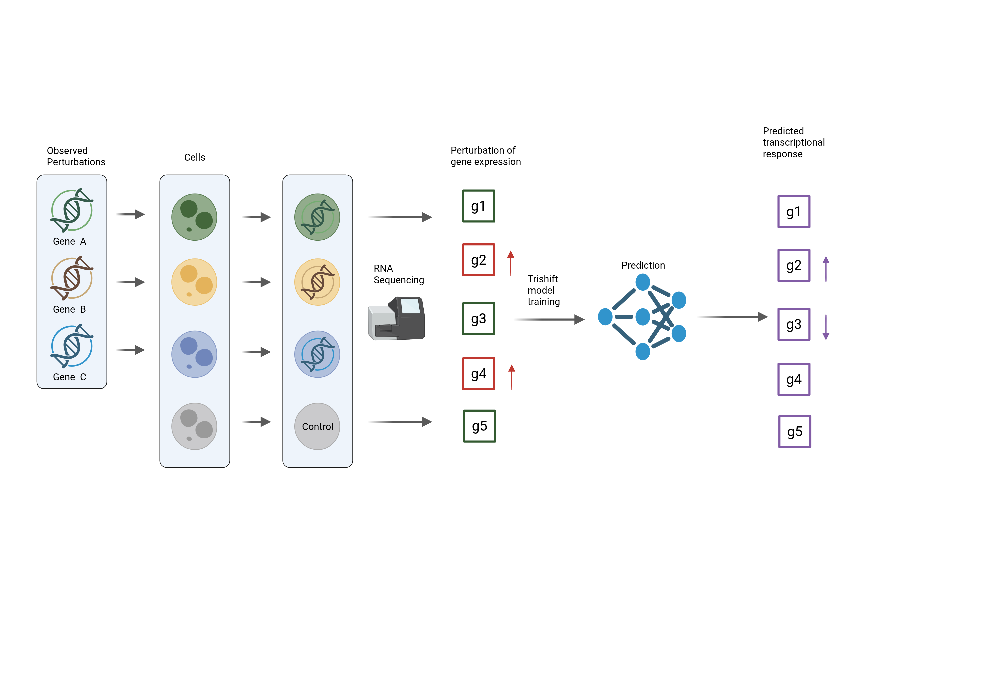
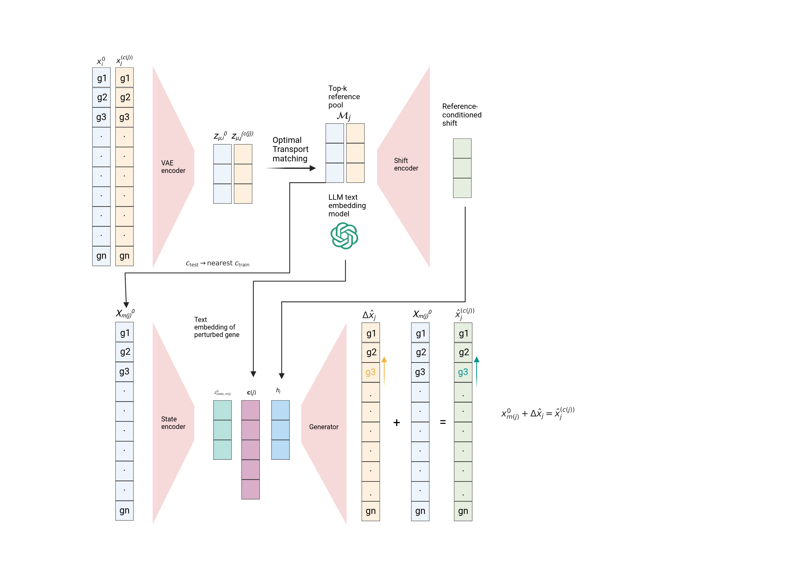

# TriShift: Tripartite Reference-Conditioned Shift Model

TriShift is a single-cell perturbation response prediction toolkit built around the `Tripartite Reference-Conditioned Shift Model` (`TriShift`). The repository contains the native TriShift implementation, shared evaluation code, benchmark wrappers for major baselines, and the notebooks used to generate the paper figures.

The project uses a `src/` layout and is installable as a Python package.

## Method overview

Overall framework:



Detailed pipeline:



## For Users

### Install the core package

```bash
pip install -e .
```

After installation:

```bash
python -c "from trishift import TriShift, TriShiftData; import trishift; print(trishift.__version__)"
```

The core package source lives in:

- `src/trishift`

Key runtime config files:

- `configs/defaults.yaml`
- `configs/paths.yaml`

### Built-in Adamson mini demo

The repository includes a tiny Adamson-derived smoke-test dataset that is small enough to ship with GitHub:

- `examples/adamson_mini`

Run it after installing the package:

```bash
python examples/adamson_mini/run_demo.py
```

This demo trains and evaluates a 10% Adamson subset with Adamson-like settings, `1` split, and `20` epochs, then writes outputs to `artifacts/demo/adamson_mini`. It is meant to validate the code path, not to reproduce paper metrics.

### Minimal custom-dataset tutorial

If you want to try TriShift on your own `AnnData`, start with:

- `notebooks/tutorial_custom_dataset.ipynb`

The tutorial shows a minimal workflow:

1. build a small `AnnData` with a `condition` column,
2. prepare a matching gene embedding table,
3. initialize `TriShiftData` and `TriShift`,
4. run a minimal train/evaluate loop,
5. export prediction payloads for downstream analysis.

### Public benchmark data

Prepare the public benchmark datasets with:

```bash
python scripts/data/download_repro_inputs.py --items benchmark genept
```

This entrypoint delegates raw data download to `GEARS/PertData`, prepares the standard simulation splits, synchronizes `perturb_processed.h5ad` files to the paths expected by TriShift and the evaluation wrappers, and downloads the default GenePT embedding.
Run this command in an environment that has `GEARS/PertData` installed. The core `pip install -e .` environment is enough for TriShift package imports, but the public benchmark downloader needs the baseline-oriented environment described below.
The maintained public benchmark scope in this repository is `adamson`, `dixit`, `norman`, plus the scGen PBMC IFN-beta cell-type transfer case described below.

By default, the repository expects local data under `src/data`. You can still override locations through:

- `configs/paths.yaml`

`src/data` is intentionally ignored by git. It is a local cache for downloaded datasets, processed `.h5ad` files, and embedding files; do not rely on files under `src/data` as repository entrypoints. Use the maintained script above for reproducible data preparation.

### scGen PBMC IFN-beta case study

The scGen PBMC case uses the Kang IFN-beta cross-cell dataset from Zenodo record
[`10.5281/zenodo.14607156`](https://zenodo.org/records/14607156), file
`kangCrossCell.h5ad.gz`. Download and decompress it to the expected local path with:

```bash
python scripts/data/download_repro_inputs.py --items scgen genept
```

If you want all protein-prior variants, include protein assets too:

```bash
python scripts/data/download_repro_inputs.py --items scgen genept protein
```

The unified downloader writes:

- `src/data/scgen/train_kang_scgen.h5ad`
- `src/data/scgen/perturb_processed.h5ad`

It also extracts the IFNB1/IFN-beta perturbation prior for the single `stimulated` condition and writes four switchable prior files under:

- `src/data/scgen/priors`

Prior extraction expects the local protein embedding files under `src/data/protein_embeddings` and the GenePT file under `src/data/Data_GeneEmbd`. Use `--skip-scgen-priors` if you only need to regenerate the `.h5ad`.

The TriShift entrypoint is:

```bash
python scripts/trishift/scgen_pbmc_celltype/run_scgen_pbmc_celltype.py
```

External baseline entrypoints for the same scGen PBMC split are:

```bash
python scripts/scpram/scgen_pbmc_celltype/run_scpram_scgen_pbmc_celltype.py
python scripts/biolord/scgen_pbmc_celltype/run_biolord_scgen_pbmc_celltype.py
```

This experiment holds out cell types, not perturbations: the only perturbation is `stimulated`, so the model trains on `stimulated` responses in seen cell types and evaluates on held-out cell types using their target-domain control cells.
To switch the prior, edit `defaults_overrides.emb_key` in:

- `scripts/trishift/scgen_pbmc_celltype/config.yaml`

Supported keys are:

- `emb_scgen_ifnb1_uniprot_prott5`
- `emb_scgen_ifnb1_zenodo_prott5`
- `emb_scgen_ifnb1_esm2_15b`
- `emb_scgen_ifnb1_genept`

BioLORD uses the same four external IFNB1 prior keys through `task_args.prior_key` in:

- `scripts/biolord/scgen_pbmc_celltype/config.yaml`

BioLORD also supports `biolord_self_attribute`, which uses a generated scalar attribute (`ctrl=0`, `stimulated=1`) instead of an external prior.

## For Reproducibility

For the complete paper workflow, including the order of TriShift, baseline, Systema, and notebook runs, see:

- `REPRODUCIBILITY_QUICK.md` for a short smoke-test and TriShift-only path
- `REPRODUCIBILITY.md`

### Quick reproduction paths

Use one of the following three scopes depending on what you need to verify.

Most local inputs can be downloaded or prepared through the unified entrypoint:

```bash
python scripts/data/download_repro_inputs.py --items benchmark genept
```

For the full local input setup, including optional protein embeddings, scGPT checkpoint files, scGen PBMC, and BioLORD-prepared h5ad files:

```bash
pip install gdown
python scripts/data/download_repro_inputs.py --items all --check
```

This command can take a long time and downloads several large files. Use `--items` to fetch only the groups you need.

1. Package smoke test

```bash
pip install -e .
python examples/adamson_mini/run_demo.py
```

This validates the core `TriShiftData -> TriShift train/evaluate -> saved outputs` path without requiring the public benchmark stack.

2. Public benchmark reproduction

```bash
python scripts/data/download_repro_inputs.py --items benchmark genept
python scripts/trishift/adamson/run_adamson.py
python scripts/trishift/dixit/run_dixit.py
python scripts/trishift/norman/run_norman.py
```

This reproduces the maintained TriShift benchmark scope in this repository and writes model outputs under `artifacts/results/<dataset>`, for example `artifacts/results/adamson`.

For the scGen PBMC case study:

```bash
python scripts/data/download_repro_inputs.py --items scgen protein genept
python scripts/trishift/scgen_pbmc_celltype/run_scgen_pbmc_celltype.py
python scripts/scpram/scgen_pbmc_celltype/run_scpram_scgen_pbmc_celltype.py
python scripts/biolord/scgen_pbmc_celltype/run_biolord_scgen_pbmc_celltype.py
```

3. Paper-figure regeneration

After the required baseline and Systema result folders exist, execute the figure notebooks listed in `REPRODUCIBILITY.md`. Primary figure artifacts are written under:

- `artifacts/paper_figures/main`
- `artifacts/paper_figures/supp`

The standalone manuscript source, compiled PDF, and supplementary document are maintained separately in:

- <https://github.com/elan6666/trishift-paper>

### Recommended environments

The lightest workflow is the core TriShift package:

```bash
pip install -e .
```

The benchmark stack mixes several external baselines with conflicting dependencies. To keep the main package usable, the repository separates:

- **Core TriShift dependencies** in `pyproject.toml`
- **Baseline-oriented environment setup** in `environment_baselines.yml`

Create the baseline environment with:

```bash
conda env create -f environment_baselines.yml
conda activate trishift-baselines
```

`environment_baselines.yml` covers the common stack used by `GEARS` and shared evaluation tools. `GEARS` still requires a Torch/PyG installation matched to your local CUDA runtime; follow the comments in that file for the final install step.

### External baseline source trees

Baseline repositories are not tracked directly because `external/` is a local, ignored workspace for third-party source trees, generated caches, and large intermediate files. To populate the external baselines and apply the tracked TriShift compatibility overlays, run:

```bash
python scripts/setup/bootstrap_external_baselines.py --only scgpt,gears,biolord,genepert,scpram
```

If you already downloaded the baseline repositories, copy from that folder instead:

```bash
python scripts/setup/bootstrap_external_baselines.py --source-root /path/to/downloads --force
```

The script places sources under `external/` and applies tracked overlays from `patches/external_overlays`. The current overlays include scGPT flash-attention compatibility files.

This bootstrap step prepares source trees only. You still need the matching conda/pip environment for each baseline before running its training script.
For the scGen PBMC baselines, `scripts/scpram/...` imports `external/scPRAM-main/scpram`, and `scripts/biolord/...` imports the installed BioLORD package while reading the local scGen `.h5ad` and IFNB1 prior files prepared by `scripts/data/prepare_scgen_pbmc.py`.

### Reproduction input checker

After downloading data and external assets, check the expected local files with:

```bash
python scripts/setup/check_repro_inputs.py --scope benchmark --strict
python scripts/setup/check_repro_inputs.py --scope baselines
python scripts/setup/check_repro_inputs.py --scope scgen
```

The checker reports missing local datasets, embeddings, BioLORD inputs, external source trees, and scGPT checkpoint files.

### Data download and preprocessing

The preferred data entrypoint is:

```bash
python scripts/data/download_repro_inputs.py --items benchmark genept
```

Useful item groups:

| Item | What it does |
| --- | --- |
| `benchmark` | Downloads/prepares Adamson, Dixit, and Norman through GEARS/PertData and syncs `perturb_processed.h5ad` files. |
| `genept` | Downloads GenePT Zenodo archives and extracts `emb_b`, `emb_c`, and `emb_d`; use `--skip-legacy-genept` to skip the older `emb_c` archive. |
| `scgen` | Downloads Kang/scGen PBMC and runs `prepare_scgen_pbmc.py` unless `--no-prepare-scgen` is passed. |
| `protein` | Downloads UniProt ProtT5, Zenodo ProtT5, and Hugging Face ESM2 protein embeddings for IFNB1 prior variants. |
| `scgpt` | Downloads the scGPT whole-human pretrained checkpoint files into `artifacts/models/scGPT_human`. |
| `biolord` | Builds BioLORD-specific h5ad files from prepared benchmark data and GO graph inputs. |
| `all` | Runs all groups above. |

Examples:

```bash
python scripts/data/download_repro_inputs.py --items benchmark genept --check --check-scope benchmark
python scripts/data/download_repro_inputs.py --items scgen protein genept --skip-scgen-priors
python scripts/data/download_repro_inputs.py --items scgpt
```

Gene embeddings are external local artifacts and are not shipped with this repository. Download the required embedding files and place them under:

- `src/data/Data_GeneEmbd`

The default `configs/paths.yaml` expects the following files:

| Config key | Expected local file | Source |
| --- | --- | --- |
| `emb_a` | `src/data/Data_GeneEmbd/ensem_emb_gpt3.5all_new.pickle` | scELMo library, file `Gene-GPT 3.5`: <https://sites.google.com/yale.edu/scelmolib> |
| `emb_b` | `src/data/Data_GeneEmbd/GenePT_gene_embedding_ada_text.pickle` | GenePT Zenodo record: <https://zenodo.org/records/10833191> |
| `emb_c` | `src/data/Data_GeneEmbd/GPT_3_5_gene_embeddings.pickle` | GenePT Zenodo record: <https://zenodo.org/records/10030426> |
| `emb_d` | `src/data/Data_GeneEmbd/GenePT_gene_protein_embedding_model_3_text.pickle` | Optional GenePT protein/text embedding used only if selected in custom configs |

If your embedding files live elsewhere, update `configs/paths.yaml` or the dataset-specific config before training.

The benchmark preparation script builds the GEARS-native dataset folders under:

- `src/data/Data_GEARS/adamson`
- `src/data/Data_GEARS/dixit`
- `src/data/Data_GEARS/norman`

It also copies each generated `perturb_processed.h5ad` into the standard outer data directories:

- `src/data/adamson/perturb_processed.h5ad`
- `src/data/dixit/perturb_processed.h5ad`
- `src/data/norman/perturb_processed.h5ad`

This keeps the repository consistent across:

- GEARS, which reads from `src/data/Data_GEARS`
- TriShift and Systema-style evaluation, which read from `src/data/<dataset>`

For the scGen PBMC case, place the scGen-preprocessed Kang PBMC file at:

- `src/data/scgen/train_kang_scgen.h5ad`

The maintained downloader uses Zenodo record `10.5281/zenodo.14607156`:

```bash
python scripts/data/download_repro_inputs.py --items scgen genept
```

The script writes `src/data/scgen/perturb_processed.h5ad` and, unless `--skip-scgen-priors` is used, writes the IFNB1 prior pickle files under `src/data/scgen/priors`. The protein prior extraction expects:

- `src/data/protein_embeddings/uniprot_prott5_human_per_protein.h5`
- `src/data/protein_embeddings/zenodo_prott5_human_reduced_embeddings_file.h5`
- `src/data/protein_embeddings/hf_esm2_15b_human_mouse_embeddings.npy`
- `src/data/protein_embeddings/hf_esm2_15b_human_mouse_metadata.csv.gz`

The GenePT prior extraction expects:

- `src/data/Data_GeneEmbd/GenePT_gene_embedding_ada_text.pickle`

Protein embedding download sources used by `scripts/data/download_repro_inputs.py --items protein`:

| Local file | Source |
| --- | --- |
| `src/data/protein_embeddings/uniprot_prott5_human_per_protein.h5` | UniProt UP000005640_9606 per-protein ProtT5: <https://ftp.uniprot.org/pub/databases/uniprot/current_release/knowledgebase/embeddings/UP000005640_9606/per-protein.h5> |
| `src/data/protein_embeddings/zenodo_prott5_human_reduced_embeddings_file.h5` | Zenodo `10.5281/zenodo.5047020`, file `reduced_embeddings_file.h5` |
| `src/data/protein_embeddings/hf_esm2_15b_human_mouse_embeddings.npy` | Hugging Face `Darkadin/ESM2_embeddings_Human_Mouse`, file `ESM2_15B_Human_Mouse_Embeddings.npy` |
| `src/data/protein_embeddings/hf_esm2_15b_human_mouse_metadata.csv.gz` | Hugging Face `Darkadin/ESM2_embeddings_Human_Mouse`, file `ESM2_15B_Human_Mouse_Metadata.csv.gz` |

For scGPT, the benchmark wrappers expect the whole-human pretrained checkpoint under:

- `artifacts/models/scGPT_human/args.json`
- `artifacts/models/scGPT_human/best_model.pt`
- `artifacts/models/scGPT_human/vocab.json`

Download it with:

```bash
pip install gdown
python scripts/data/download_repro_inputs.py --items scgpt
```

The script uses the public Google Drive file ids distributed with the scGPT whole-human checkpoint. If you place the checkpoint elsewhere, update `scgpt_pretrained_root` in `configs/paths.yaml`.

### Training and evaluation entrypoints

Recommended dataset entrypoints are organized by model and dataset under `scripts/<model>/<dataset>`.
The maintained public targets are `adamson`, `dixit`, `norman`, and the scGen PBMC IFN-beta cell-type transfer case.

The maintained public interfaces for manuscript reproduction are:

- benchmark data preparation under `scripts/data`
- model entrypoints under `scripts/<model>/<dataset>`
- shared evaluation cores under `scripts/*/_core`
- figure notebooks under `notebooks`
- reproducibility instructions in `README.md` and `REPRODUCIBILITY.md`

TriShift:

- `scripts/trishift/adamson/run_adamson.py`
- `scripts/trishift/dixit/run_dixit.py`
- `scripts/trishift/norman/run_norman.py`
- `scripts/trishift/scgen_pbmc_celltype/run_scgen_pbmc_celltype.py`

GEARS:

- `scripts/gears/adamson/run_gears_adamson.py`
- `scripts/gears/dixit/run_gears_dixit.py`
- `scripts/gears/norman/run_gears_norman.py`

Additional baselines:

- `scripts/genepert/<dataset>/run_genepert_*.py`
- `scripts/scgpt/<dataset>/run_scgpt_*.py`
- `scripts/scpram/scgen_pbmc_celltype/run_scpram_scgen_pbmc_celltype.py`
- `scripts/biolord/<dataset>/run_biolord_*.py`
- `scripts/systema/<dataset>/run_systema_*.py`

Shared training core:

- `scripts/trishift/_core/run_dataset_core.py`
- `scripts/trishift/train/run_dataset.py`

### Figure generation

The paper figures are generated from the notebooks under `notebooks/`:

- `Fig2_MultiDatasetBenchmark.ipynb` -> Fig. 2
- `Fig3_ReferenceConditioning.ipynb` -> Fig. 3
- `Fig4_NormanGeneralization.ipynb` -> Fig. 4
- `Fig5_DistributionRecovery.ipynb` -> Fig. 5
- `FigS1_BenchmarkExtension.ipynb` -> Fig. S1
- `FigS2_AdditionalCases.ipynb` -> Fig. S2
- `FigS3_BiologyAndAblation.ipynb` -> Fig. S3
- `FigS4_CentroidAnalysis.ipynb` -> Fig. S4
- `FigS5_Robustness.ipynb` -> Fig. S5
- `FigS6_Stage1LatentClustering.ipynb` -> Fig. S6

Primary outputs are written under:

- `artifacts/results`
- `artifacts/paper_figures`

### Notes

- Legacy top-level `scripts/run_*` files, if present, should be treated as compatibility entrypoints rather than the primary maintained interface.
- Local paper drafts and supporting notes may live under `docs/`; this directory is intentionally ignored by git and is not part of the reproducible repository interface.
- Large local outputs, datasets, and external baseline clones are intentionally ignored by git.
